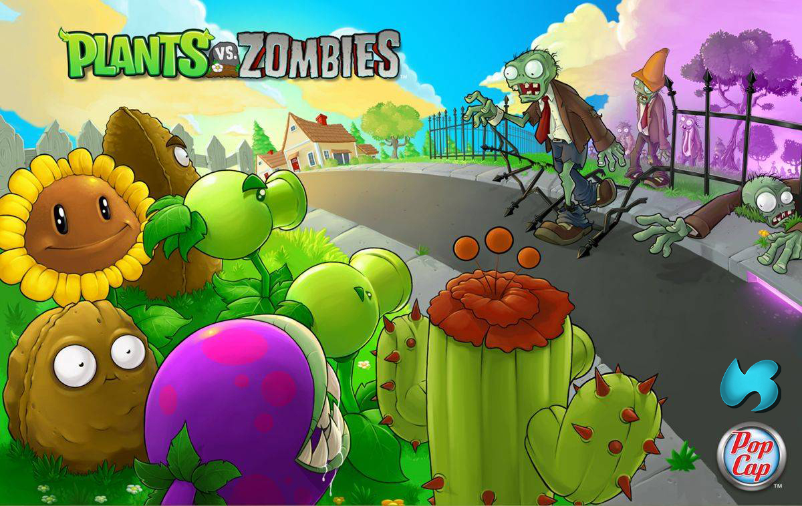
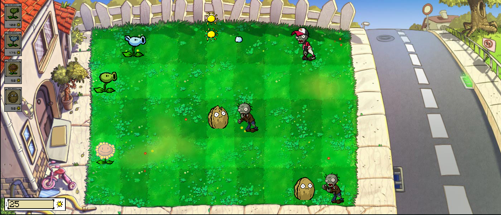
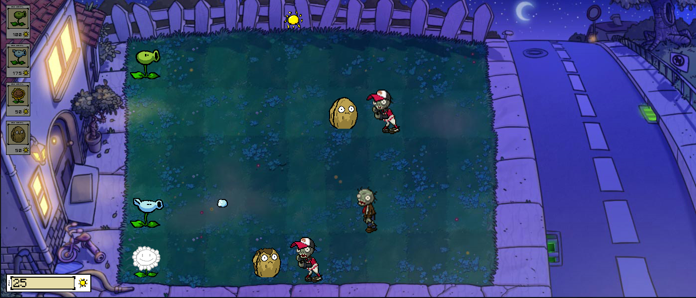

# 🌱 Plants vs. Zombies (C++ & SFML)

> **Advanced Programming - University of Tehran - Department of Electrical & Computer Engineering**

  

## 📌 Overview

This repository contains a fan-made implementation of the classic **Plants vs. Zombies** game, developed in C++ using the SFML multimedia library. This project was carried out as the *Fifth Assignment* for the *Advanced Programming* course at the University of Tehran.

A fan-made recreation of the classic **Plants vs. Zombies** game, built from scratch in **C++20** using the **SFML graphics library**.  
This project was developed as part of my academic and personal exploration into **game development, object-oriented programming, and graphics rendering**.




## 🎮 Features
- Classic **tower-defense gameplay**: defend your lawn against waves of zombies.
- Implemented core mechanics:
  - 🌻 **Sunflowers** generate sun (currency).  
  - 🌱 **Peashooters & Snow Peas** attack zombies.  
  - 🧱 **Wall-nuts** block zombie progress.  
  - 💀 Multiple zombie types with different behaviors.
- **Grid-based lawn system** with lane-based strategy.
- **Smooth animations and sound effects** powered by SFML.
- Modular, object-oriented design for easy extension.


## 🛠️ Tech Stack
- **Language:** C++20  
- **Graphics & Audio:** [SFML](https://www.sfml-dev.org/)  
- **Build System:** Makefile  
- **OS Compatibility:** Linux (tested), should work on Windows/macOS with SFML installed  


## 🚀 Getting Started
### 1. Clone the repository
```bash
git clone https://github.com/mragetsars/Plants-VS-Zombies.git
cd Plants-VS-Zombies
```
### 2. Install dependencies
Make sure you have **SFML** installed on your system. For example, on Ubuntu:
```bash
sudo apt-get install libsfml-dev
```
### 3. Build and Run the game
```bash
make clean #Clean build files
make
./pvz.out
```


## 📂 Repository Structure

The project is organized as follows:

```text
Plants-VS-Zombies/
├── src/                     # Implementation files (.cpp)
│   ├── main.cpp             # Game entry point
│   ├── game_handler.cpp     # Core game engine and event loop
│   ├── plant.cpp            # Plant behaviors and mechanics
│   ├── zombie.cpp           # Zombie AI and movement logic
│   └── ...                  # Other module.cpp implementations
├── include/                 # Header files (.hpp)
│   ├── global.hpp           # Constant values and game settings
│   ├── game_handler.hpp     # Engine definitions
│   ├── plant.hpp            # Plant class hierarchy
│   ├── zombie.hpp           # Enemy class definitions
│   └── ...                  # Other module.hpp headers
├── files/                   # Multimedia assets (Game Data)
│   ├── pics/                # Sprites & Textures (Organized by prefix)
│   │   ├── c_*.png          # Cards UI elements
│   │   ├── p_*.png          # Plants (Idle/Attack/Glow)
│   │   ├── z_*.png          # Zombies (Walking/Eating/Dying)
│   │   ├── v_*.png          # Projectiles and VFX (Peas, Sun, etc.)
│   │   └── g_*.png          # Backgrounds and Screen overlays
│   ├── audio/               # Background music (bg.ogg)
│   ├── fonts/               # Game typography (SunSignFont.otf)
│   └── screenshots/         # README preview images
├── obj/                     # Compiled object files (.o)
├── Makefile                 # Build system configuration
├── Settings                 # Game balance and config parameters
└── pvz.out                  # Compiled executable (Linux)
```


## 🎨 Screenshots
<p align="center">
  
  
</p>


## 📖 Future Improvements
- Add more plant and zombie types (Cherry Bomb, Potato Mine, Conehead Zombie, etc.)
- Implement level progression and menus.
- Improve animations and sound design.
- Cross-platform build instructions (Windows/macOS).


## 🙌 Acknowledgments
- Inspired by **PopCap’s Plants vs. Zombies**.  
- Built with ❤️ using **C++** and **SFML**.  
- By Meraj Rastegar
